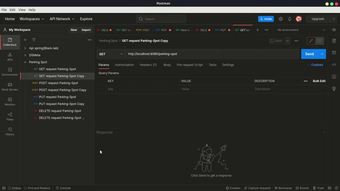

<h1 align="center">Parking Spot Control</h1>
<h3 align="center">Este projeto gerencia o controle de estacionamento de um condomínio/prédio </h3>

  * [Sobre](#Sobre)
   
   * [Instalação](#instalacao)
       * [Pré-requisitos](#pre-requisitos)
       * [Instalando o Projeto na máquina](#instalando-o-projeto-na-maquina)
   

   * [Testes](#testes)
   * [Tecnologias](#tecnologias)

## Sobre
É facil perceber que a administração das vagas de garagem em um condomínio se da de maneira manual, tornando o processo demorado e não automatizado. Esta API tem a ideia central de pegar os dados dos moradores como nome, apartamento, bloco, placa do carro, modelo, etc e armazenar em um banco de dados, assim quando for adicionar/verificar/deletar qualquer dado daquele morador em relação a vaga de carro a API registrara estes novos dados, dessa forma têm-se um controle maior das vagas;


## Instalação
<h3>Pré-requisitos</h3>

Antes de começar, você vai precisar ter instalado em sua máquina as seguintes ferramentas:
Git, OpenJDK, Spring Boot framework, maven para gerenciar as dependências e o POSTMAN para testar. 
Além disto é bom ter um editor para trabalhar com o código como VSCode.

### 🎲 Instalando o Projeto na máquina

* Clone este repositório
```bash
$ git clone <git@github.com:KelytonSantos/ParkingSpotControl.git>
```

* Extraia o projeto

* Abra com o seu editor de código

* Configure o seu banco de dados em aplication.properties (aqui eu uso o MySQL)
```bash
#configuração do aplication.properties para o MySQL

spring.datasource.url=jdbc:mysql://localhost:3306/<nomeDaTabela>
spring.datasource.username=<seuUserName>
spring.datasource.password=<suaSenha>
spring.datasource.driver-class-name=com.mysql.cj.jdbc.Driver
spring.jpa.hibernate.ddl-auto=update
spring.jpa.show-sql=true
spring.jpa.properties.hibernate.format_sql=true
```
* Depois de baixar as dependências e configurar o banco de dados é só clicar no botão de run (Atalho VSCode: Ctrl+F5)  

* O servidor inciará na porta:8080 - acesse <http://localhost:8080>
## Testes
* Para executar as operações de CRUD vamos utilizar o POSTMAN;
* Abaixo temos um .gif com o resultado das consultas.

<h1 align="center">
    
</h1>

## 🛠 Tecnologias

As seguintes ferramentas foram usadas na construção do projeto:

- Spring MVC
- Spring Boot Framework
- Maven
- Java OpenJDK
- Spring Data JPA

<h1></h1>

### By Kelyton Santos
<a href="https://www.instagram.com/kelytonlucas/" target="_blank"></a> <a href="https://www.linkedin.com/in/kelyton-lucas-4a892a1b6/" target="_blank"></a> <a href = "mailto:kelytonlucas@gmail.com"></a>


